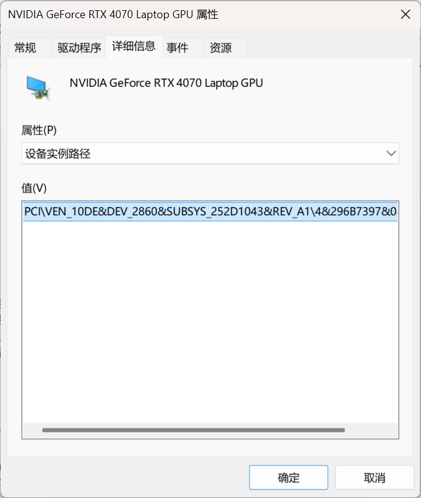

在部分场景下，我们需要在虚拟机内使用 GPU 来进行硬件加速。

有两种方案来帮我们完成这个目标:

- GPU 分区 (`GPU-P`)
- 离散设备分配 (`DDA`)

离散设备分配 (`DDA`) 可将整个 GPU 直通进虚拟机，但是宿主机和其它虚拟机将无法使用。

在部分场景下，这个实现方案很实用。

但是对个人用户来说，我们既想让虚拟机可以使用 GPU ，又想让宿主机也能使用 GPU 。

GPU 分区 (`GPU-P`) 通过将 GPU 资源"切块"，来给一个或者多个虚拟机使用。

> 社区有时会把 GPU-P 也称为"`GPU Passthrough`"，但严格来说 `Passthrough` 更常指 `DDA`（直通整卡）。

本文将在 Windows 11 Pro 主机上，使用 Hyper-V 的 GPU 分区 (`GPU-P`) 功能，将 NVIDIA GeForce RTX 4070 Laptop 显卡的部分资源分配给 Windows 11 虚拟机使用。

## 前提条件

- 宿主机与虚拟机正在运行 Windows 10 20H1/Windows 11 或 Windows Server 2022 及以上版本的操作系统
- 宿主机的硬件条件允许启用 Hyper-V
- 目标硬件支持 `GPU-P`

在进行分配之前，确保你的 GPU 支持 `GPU-P` 功能。

在 Powershell 中运行以下命令:

```powershell
Get-VMHostPartitionableGpu # Windows 11 / Windows Server 2025
Get-VMPartitionableGpu     # Windows 10 / Windows Server 2022
```

之后查看输出， 本人的输出如下：

```powershell "?\PCI#VEN_10DE&DEV_2860&SUBSYS_252D1043&REV_A1#4&296b7397&0&0008#{064092b3-625e-43bf-9eb5-dc845897dd59}\GPUPARAV" "?\PCI#VEN_8086&DEV_A7A0&SUBSYS_252D1043&REV_04#3&11583659&0&10#{064092b3-625e-43bf-9eb5-dc845897dd59}\GPUPARAV"

Name                          : \\?\PCI#VEN_10DE&DEV_2860&SUBSYS_252D1043&REV_A1#4&296b7397&0&0008#{064092b3-625e-43bf-9eb5-dc845897dd59}\GPUPARAV
ValidPartitionCounts          : {32}
PartitionCount                : 32
TotalVRAM                     : 1000000000
AvailableVRAM                 : 1000000000
SupportsIncomingLiveMigration : False
MinPartitionVRAM              : 0
MaxPartitionVRAM              : 1000000000
OptimalPartitionVRAM          : 1000000000
TotalEncode                   : 18446744073709551615
AvailableEncode               : 18446744073709551615
MinPartitionEncode            : 0
MaxPartitionEncode            : 18446744073709551615
OptimalPartitionEncode        : 18446744073709551615
TotalDecode                   : 1000000000
AvailableDecode               : 1000000000
MinPartitionDecode            : 0
MaxPartitionDecode            : 1000000000
OptimalPartitionDecode        : 1000000000
TotalCompute                  : 1000000000
AvailableCompute              : 1000000000
MinPartitionCompute           : 0
MaxPartitionCompute           : 1000000000
OptimalPartitionCompute       : 1000000000
CimSession                    : CimSession: .
ComputerName                  : SINGL-LAPTOP
IsDeleted                     : False

Name                          : \\?\PCI#VEN_8086&DEV_A7A0&SUBSYS_252D1043&REV_04#3&11583659&0&10#{064092b3-625e-43bf-9eb5-dc845897dd59}\GPUPARAV
ValidPartitionCounts          : {32}
PartitionCount                : 32
TotalVRAM                     : 1000000000
AvailableVRAM                 : 1000000000
SupportsIncomingLiveMigration : False
MinPartitionVRAM              : 0
MaxPartitionVRAM              : 1000000000
OptimalPartitionVRAM          : 1000000000
TotalEncode                   : 18446744073709551615
AvailableEncode               : 18446744073709551615
MinPartitionEncode            : 0
MaxPartitionEncode            : 18446744073709551615
OptimalPartitionEncode        : 18446744073709551615
TotalDecode                   : 1000000000
AvailableDecode               : 1000000000
MinPartitionDecode            : 0
MaxPartitionDecode            : 1000000000
OptimalPartitionDecode        : 1000000000
TotalCompute                  : 1000000000
AvailableCompute              : 1000000000
MinPartitionCompute           : 0
MaxPartitionCompute           : 1000000000
OptimalPartitionCompute       : 1000000000
CimSession                    : CimSession: .
ComputerName                  : SINGL-LAPTOP
IsDeleted                     : False

```

:::tip
`TotalVRAM`/`TotalEncode`/`TotalDecode`/`TotalCompute` 这些值是“相对配额”，范围为 0–1,000,000,000，表示 0%–100%。  
因此 100,000,000 ≈ 10%，并非字节数。
:::

输出了一大堆信息，我们可以看出来有两个设备支持 `GPU-P` 功能。

但是这个命令并没有给出 GPU 的具体型号，我们要去设备管理器查询设备的"实例路径"。

在设备管理器中，找到显示适配器，右键点击目标 GPU 选择"属性"。

在弹出的窗口中，切换到"详细信息"选项卡，在属性下拉菜单中选择"设备实例路径"。



如图所示，本人的 NVIDIA GeForce RTX 4070 Laptop 显卡的设备实例路径为:

```log
PCI\VEN_10DE&DEV_2860&SUBSYS_252D1043&REV_A1\4&296b7397&0&0008
```

然后我们去刚才输出的 Powershell 结果中，找到对应的设备。

```powershell
Name                          : \\?\PCI#VEN_10DE&DEV_2860&SUBSYS_252D1043&REV_A1#4&296b7397&0&0008#{064092b3-625e-43bf-9eb5-dc845897dd59}\GPUPARAV
```

找到了，复制这个 `Name` 字段的值，后续我们会用到。

## 配置 GPU-P

在所有操作之前，先让目标虚拟机关机。用管理员 PowerShell 执行以下命令。

```powershell wrap=false {"1. 更改为你自己的虚拟机名和设备路径": 2-4} {"2. 删除适配器 (如果有) 并添加新的适配器": 6-8} {"3. 调整适配器参数 (一般可直接照抄)": 10-14} {"4. 调整缓存设置及 MMIO 大小": 16-19}
# 按照步骤，编辑之后再控制台执行

$vm      = "exampleName"
$gpuPath = "examplePath"


Remove-VMGpuPartitionAdapter -VMName $vm
Add-VMGpuPartitionAdapter    -VMName $vm -InstancePath $gpuPath


Set-VMGpuPartitionAdapter -VMName $vm -MinPartitionVRAM 80000000    -MaxPartitionVRAM 100000000    -OptimalPartitionVRAM 100000000
Set-VMGpuPartitionAdapter -VMName $vm -MinPartitionEncode 80000000  -MaxPartitionEncode 100000000  -OptimalPartitionEncode 100000000
Set-VMGpuPartitionAdapter -VMName $vm -MinPartitionDecode 80000000  -MaxPartitionDecode 100000000  -OptimalPartitionDecode 100000000
Set-VMGpuPartitionAdapter -VMName $vm -MinPartitionCompute 80000000 -MaxPartitionCompute 100000000 -OptimalPartitionCompute 100000000


Set-VM -GuestControlledCacheTypes $true -VMName $vm
Set-VM -LowMemoryMappedIoSpace    1GB   -VMName $vm
Set-VM -HighMemoryMappedIoSpace   32GB  -VMName $vm

```

关于缓存和 `MMIO` 的一些常见问题，请参阅[常见问题](#常见问题)。

:::warning
如果你正在 Windows Server 上配置，那么你现在是打不开虚拟机的。

由于 Microsoft 的 `SecureDeviceAssignment` 和 `SupportedDeviceAssignment`，你需要添加两个注册表项才能继续。

> 摘自[Windows 驱动程序开发 - Microsoft Docs](https://learn.microsoft.com/en-us/windows-hardware/drivers/ddi/dispmprt/ns-dispmprt-_dxgkarg_getvirtualgpuprofile#members)

使用 Powershell 运行这些命令即可添加注册表项。

```powershell
Set-ItemProperty -Path "HKLM:\SOFTWARE\Policies\Microsoft\Windows\HyperV" -Name "RequireSecureDeviceAssignment" -Type DWORD -Value 0 -Force
Set-ItemProperty -Path "HKLM:\SOFTWARE\Policies\Microsoft\Windows\HyperV" -Name "RequireSupportedDeviceAssignment" -Type DWORD -Value 0 -Force
```

:::

## 复制设备驱动

做到这里，你已经完成了 GPU 分区的配置，可以启动虚拟机进入系统了。

进入系统后，你会发现虽然在设备管理器可以找到设备，但是设备不可用(一般是`代码 43`)。

这并不是我们配置失误，而是我们没有把相应驱动复制到虚拟机。

前往宿主机的`C:\Windows\System32\DriverStore\FileRepository\`文件夹，我们可以发现有很多驱动。

找到你的 GPU 驱动(这一步可以使用 `dxdiag` 查询)，然后把整个文件夹拷到虚拟机备用。

> 如果你觉得有点麻烦，那你可以使用 [DISM++](https://github.com/Chuyu-Team/Dism-Multi-language/releases/latest) 来自动提取 GPU 驱动。  
> 如果你连这都嫌麻烦，那你干脆把所有驱动全拷出来也行。

之后前往虚拟机的`C:\Windows\System32\HostDriverStore\FileRepository\`文件夹。

> 一般`HostDriverStore\FileRepository\`不存在，需要你手动新建文件夹。

然后把刚刚拷到虚拟机的驱动移动到这个文件夹。

最后重启，不出意外的话 GPU 就会开始工作。

## 验证

- 在虚拟机设备管理器中应看到目标 GPU，无黄色感叹号。
- 运行 `dxdiag` 或 `Task Manager -> 性能 -> GPU` 可看到 GPU 使用情况。
- 使用支持 DX11/12 或其他图形 API 的应用程序，看到渲染/解码正在使用 GPU。

## 常见问题

### GuestControlledCacheTypes 是什么？

摘自 [Microsoft Community Hub](https://techcommunity.microsoft.com/t5/Virtualization/Discrete-Device-Assignment-GPUs/ba-p/382266):

> 如果处理器能够以一种模式运行，使其在将数据写入内存之前，先把视频内存中的数据在处理器缓存中暂存，以便合并对同一内存的其他写入，那么 GPU 往往会快得多。
> 这称为“写合并”（write-combining）。

启用后通常能获得更好的 GPU 性能，推荐开启。

### LowMemoryMappedIoSpace 和 HighMemoryMappedIoSpace 是什么？我该怎么填写大小？

摘自 [Microsoft Docs](https://learn.microsoft.com/zh-cn/windows-server/virtualization/hyper-v/plan/plan-for-deploying-devices-using-discrete-device-assignment#mmio-space):

> 某些设备（尤其是 GPU）需要为 VM 分配更多的 `MMIO` 空间，以便可以访问该设备的内存。  
> 默认情况下，最初为每个 VM 分配 128 MB 的低 `MMIO` 空间和 512 MB 的高 `MMIO` 空间。  
> 但是，某个设备可能需要更多 `MMIO` 空间，或者可能有多个设备直通，因而各种要求导致超过了这些值。
> 低 `MMIO` 空间仅由 32 位操作系统和使用 32 位地址的设备使用。  
> 在大多数情况下，设置 VM 的高 `MMIO` 空间就足够了，因为 32 位配置并不常见。

Microsoft 推荐使用[SurveyDDA.ps1](https://github.com/Microsoft/Virtualization-Documentation/blob/live/hyperv-tools/DiscreteDeviceAssignment/SurveyDDA.ps1)来查询设备的 `MMIO` 相关信息。

:::important
如果你的设备无法通过`SurveyDDA.ps1`查询最小 `MMIO` 空间，  
那么恭喜你，你只能开赌了。
:::

在获取到该设备所需的最小 `MMIO` 空间后，我们可以代入以下公式计算：

```log "所有直通物理设备所需 MMIO 空间的总和"
所需总 MMIO 空间 (MB) = (所有直通物理设备所需 MMIO 空间的总和) + 你要额外分配的 MMIO 缓冲区
```

你可能有一个疑问，所有直通物理设备所需 `MMIO` 空间的总和是什么？

举个例子，假设你给虚拟机直通了两个设备：

- NVIDIA RTX 4090 GPU
- Intel X710 万兆光纤网卡

并且假设你运行了`SurveyDDA.ps1`，获取到了以下输出：

```log "16384 MB" "32 MB"
NVIDIA GeForce RTX 4090
...
    And it requires at least: 16384 MB of MMIO gap space
...


Intel(R) Ethernet Controller X710 for 10GbE SFP+
...
    And it requires at least: 32 MB of MMIO gap space
...

```

那么我们就知道了：

- NVIDIA GeForce RTX 4090 需要 `16384MB` 的 `MMIO` 空间。
- Intel X710 万兆光纤网卡 需要 `32MB` 的 `MMIO` 空间。

再假设你要分配 `512MB` `MMIO` 缓冲区，那么最终要分配的 `MMIO` 空间就是：

```log "16928 MB"
16384 MB + 32 MB  = 16416 MB  (所有直通物理设备所需 MMIO 空间的总和)

16416 MB + 512 MB = 16928 MB  (所需总 MMIO 空间)
```

本文给出的 `MMIO` 空间分配已经足够大，一般不需要二次调整。

如果你喜欢，可以自己调参到一个合适的大小。

### 我在任务管理器看到了`代码12`？

`MMIO` 大小没有调好。

参考[填写教程](#lowmemorymappediospace-和-highmemorymappediospace-是什么我该怎么填写大小)来解决。

### `GPU-P` 与 `DDA` 有什么区别？

- `DDA`：直通整个物理设备，宿主机无法再用该设备。
- `GPU-P`：按“分区/配额”共享同一物理 GPU，宿主机与多 VM 可同时使用，更灵活。

### `GPU-P` 的配额数值是不是“字节”？

不是。`VRAM`/`Encode`/`Decode`/`Compute` 为相对配额（0–1,000,000,000），表示 0%–100%。

例如 `100,000,000` ≈ `10%`。

### 适用哪些客户机？

- Windows 10/11 与 Windows Server 2022+ 体验最佳。
- Linux 客户机官方尚未直接支持。
  > Microsoft 的 WSL2 虽基于此方案，但尚未在 Hyper-V 内被支持。

### 不想使用了，如何还原更改？

1. 关闭目标虚拟机。
2. 运行以下 PowerShell 命令：

```powershell
Remove-VMGpuPartitionAdapter -VMName "<你的VM名>"
Set-VM -GuestControlledCacheTypes $false -VMName "<你的VM名>"
```
